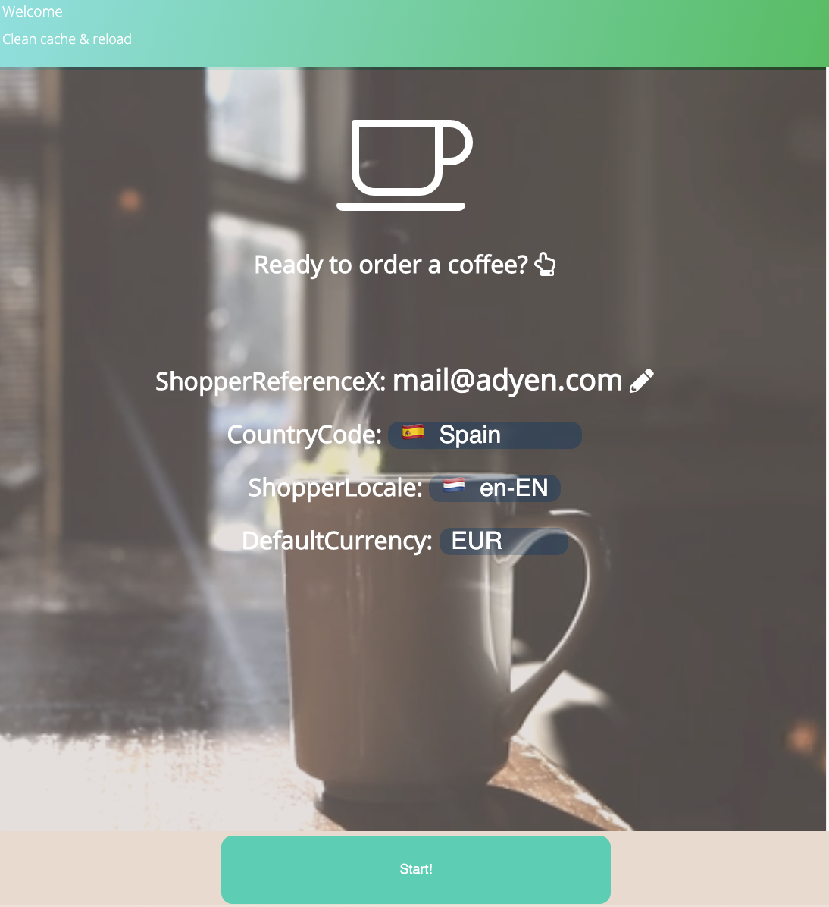
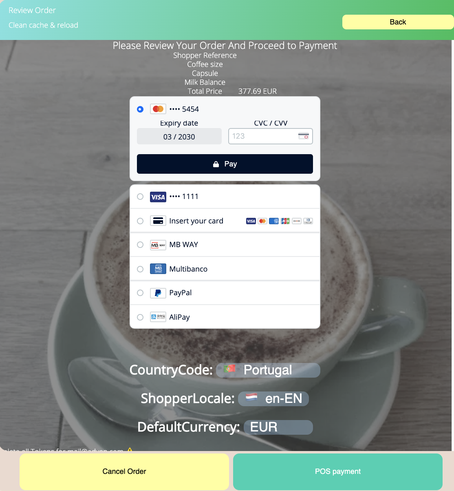

# Coffee kiosk adyen dropin

This is a simple demo of a self service coffee kiosk using adyen dropin checkout.

> [Getting Started](https://docs.adyen.com/checkout/)

## Drop-in

Drop-in is our all-in-one UI solution that you can add on your payments form so you can start accepting transactions for key payment methods using a single front-end implementation.

The [Drop-in](https://docs.adyen.com/checkout/drop-in-web/) handles the presentation of available payment methods and the subsequent entry of a customer's payment details. It is initialized with the response of [`/paymentMethods`](https://docs.adyen.com/api-explorer/#/CheckoutService/v67/post/paymentMethods), and provides everything you need to make an API call to [`/payments`](https://docs.adyen.com/api-explorer/#/CheckoutService/v66/post/payments) and [`/payments/details`](https://docs.adyen.com/api-explorer/#/CheckoutService/v66/post/payments/details)).

> [Drop-in Documentation](https://docs.adyen.com/checkout/drop-in-web/)

## Development environment

Follow these steps to run our development playground:

* Clone [this repository](https://github.com/epereztg/self-checkout-kiosk) and navigate to the root of the project.
* Create a `.env` file on your project's root folder following the example on `.env.default` and fill in the necessary environment variables.
* Install all dependencies by running `npm install`.
* Start the development playground by running `npm start` or `./start.sh`. This will start a local server on [http://localhost:3000](http://localhost:3000).
